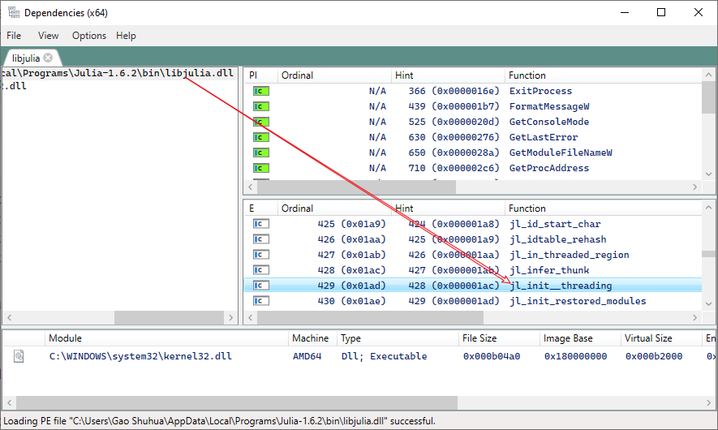

# Introduction to basic Julia embedding in C#

## Main reference
Refer to the [Embedding Julia](https://docs.julialang.org/en/v1/manual/embedding/#Embedding-Julia) official documentation. What we will do is largely to translate the C embedding method therein into C# via P/Invoke.

## An example
Consider the versatile C function `jl_eval_string`, which is used to evaluate some given Julia code supplied as a string (see [source](https://github1s.com/JuliaLang/julia/blob/HEAD/src/julia.h#L1738)):
```c
jl_value_t *jl_eval_string(const char *str);
```
- What is `jl_value_t`?

    As explained in [Memory layout of Julia Objects](https://docs.julialang.org/en/v1/devdocs/object/)
    > The jl_value_t struct is the name for a block of memory owned by the Julia Garbage Collector, representing the data associated with a Julia object in memory. Absent any type information, it is simply an opaque pointer.

    We may simply view `jl_value_t` a wrapper of any object in Julia.

    There is no need to figure out the actual definition or even attempt to marshal it in C#, since the C API only deals with its pointer `jl_value_t*`. A pointer variable of any type in C can be represented by the [IntPtr](https://docs.microsoft.com/en-us/dotnet/api/system.intptr?view=net-5.0) in C#. In other words, `IntPtr` may be viewed as a `void*` in C/C++. 

- How to marshal `const char*` parameter?
  
    Simply specify the character set used to `CharSet.Ansi` (which is the default one and thus can be omitted) to marshal the `char*`-represented string in C. The parameter type in C# becomes `string` instead.

Finally, we get the P/Invoke form of the above `jl_eval_string` function.
```csharp
[DllImport("libjulia.dll", CallingConvention = CallingConvention.Cdecl)]
public static extern IntPtr jl_eval_string(string str);
```
or equivalently (by specifying explicitly the `CharSet`):
```csharp
[DllImport("libjulia.dll", CallingConvention = CallingConvention.Cdecl, CharSet = CharSet.Ansi)]
public static extern IntPtr jl_eval_string(string str);
```
More comments:
- The `CallingConvention = CallingConvention.Cdecl` is **mandatory** because we are dealing with a C exported API. The `CallingConvention` above defaults to the `StdCall` convention on Windows, and `Cdecl` on all other platforms (see [doc](https://docs.microsoft.com/en-us/dotnet/api/system.runtime.interopservices.dllimportattribute.callingconvention?view=net-5.0)).
- How does `DllImport` find the `libjulia.dll`?

  There is a defined list of directories to search the DLL. In general, we can place our DLL in three convenient places:
    + The directory from which the application loaded.
    + The current directory
    + The directories that are listed in the PATH environment variable.
  
   As for the Julia case, we in fact make use of the PATH variable approach. Anyway, you need to add the *bin* folder of Julia (e.g., `...\Julia 1.5.3\bin` on Windows) to PATH to locate the `julia` command in a terminal. (When installing Julia on Windows, check "Add Julia to PATH" to enable it automatically.)

    More details of the DLL search path are discussed on StackOverflow [here](https://stackoverflow.com/questions/8836093/how-can-i-specify-a-dllimport-path-at-runtime/8861895).


## Specific operations of Julia in C#

### Call a function by `f`

#### Naïve way: use `jl_eval_string`
For simple calls, we may evaluate it as a string like `jl_value_t *ret = jl_eval_string("sqrt(2.0)");` in the official documentation. However, the `eval` in Julia can be very slow (see [Performance of `Meta.parse` and `eval`](https://discourse.julialang.org/t/performance-of-meta-parse-and-eval/52061)) and compromise the performance if it is used frequently (e.g., in a loop). In addition, it tends to be awkward to pass non-literal parameters in this way. 

#### Better: use `jl_call`
A better way is to use the `jl_call*` series function as introduced in Section [Calling Julia Functions](https://docs.julialang.org/en/v1/manual/embedding/#Calling-Julia-Functions), though it is a little verbose. For example, `jl_call1` handles a function call with a single argument:
```c
jl_value_t *jl_call1(jl_function_t *f JL_MAYBE_UNROOTED, jl_value_t *a JL_MAYBE_UNROOTED);
```
where the first parameter is the function and the second is the argument, both as pointers. Hence, we have to first build/obtain the two pointers.

If the function `f` has been exported by a module `M`,  evaluating `using M`  in Julia brings `f` into scope, and then evaluating `f` gets directly the function pointer. Take `sin` for example (introduced by the `Base` module, and `Base` is used by default).
```csharp
IntPtr sin = Julia.jl_eval_string("sin");
IntPtr arg = Julia.jl_box_float64(2.34);
IntPtr pRes = Julia.jl_call1(sin, arg);
// memory not safe here!!
double res = Julia.jl_unbox_float64(pRes);
```
Note above that we use `jl_box_float64` to allocate a `jl_value_t` struct on the Julia side that boxes a single `float64` number. We cannot pass 2.34 directly into `jl_call1` according to its signature.

Similarly, the returned value of `jl_call1` resides in Julia's managed memory (wrapped by a `jl_value_t`) and can be accessed by a pointer to that struct. 

Do note that the operation above is simplified to better illustrate the main idea. We cannot ensure that the memory referred to by `pRes` is still valid when performing the next *unbox* operation (because that particular memory is managed by Julia and may be garbage collected anytime).


### Use/get a module
- In Julia, `using M` introduces the module `M`, and we get access to this module via `M`. Take the `Base` module for example.
    ```julia
    julia> using Base
    
    julia> Base
    Base
    
    julia> typeof(Base)
    Module
    ```
- In C/C#, we get a pointer to this module by evaluating `M` in Julia. That is, as shown above, the return of `Base` is itself.
    ```csharp
    IntPtr mBase = Julia.jl_eval_string("Base");
    ```
    The above `mBase` is a `jl_value_t*` that effectively points to the module `Base`.

### Call a function by its full name `M.f`
What shall we do if the function is not exported by the module? We have to use its full name, e.g., functions in `Pkg`. Two solutions are listed below.

- A simpler way with `jl_eval_string`

  Since we only need to call `jl_eval_string` once to get the function reference (a pointer), the performance issue should not matter here in general.
  ```csharp
  // call Pkg.envdir()
  Julia.jl_eval_string("using Pkg");
  IntPtr envdir = Julia.jl_eval_string("Pkg.envdir"); // the function
  IntPtr p1 = Julia.jl_call0(envdir); // return jl_value_t*
  IntPtr p2 = Julia.jl_string_ptr(p1); //get const char* from jl_value_t* since the true return is a string
  string envdirRes = Marshal.PtrToStringAnsi(p2);  // const char* --> C# string
  Console.WriteLine($"Pkg.envdir() -> {envdirRes}");
  ```

- A complicated way with `jl_get_global`

    We can also resort to the API `jl_get_function` in C to get a full qualified symbol. See [Calling local Julia package from C](https://stackoverflow.com/questions/55970064/calling-local-julia-package-from-c). Unfortunately, this API is not exported in the DLL. 
    ```c
    STATIC_INLINE jl_function_t *jl_get_function(jl_module_t *m, const char *name)
    {
        return (jl_function_t*)jl_get_global(m, jl_symbol(name));
    }
    ```
    On the other hand, the internal `jl_get_global` is exported. 
    ```csharp
    [DllImport("libjulia.dll", CallingConvention = CallingConvention.Cdecl)]
    public static extern IntPtr jl_get_global(IntPtr module, IntPtr sym);
    ```
    We have to get pointers to (1) the module (like we have done above) and (2) the symbol (e.g., a function name) to make use of `jl_get_global`. Details are omitted here. Interested readers may check the source code in *Program.cs*.


## Caveats
### :question: About `jl_init`
In the [Embedding Julia](https://docs.julialang.org/en/v1/manual/embedding/#Embedding-Julia) documentation, the first step is always to initialize Julia via `jl_init()`. However, if you `DllImport` the `jl_init` function directly, an error will be thrown, since `jl_init` is just a macro in C and the true symbol exported is actually `jl_init__threading`. Check the [julia.h source code](https://github1s.com/JuliaLang/julia/blob/v1.5.4/src/julia.h#L1579) to find

```c
#define jl_init jl_init__threading
```
Thus, the correct import in C# is 
```csharp
[DllImport("libjulia.dll", CallingConvention = CallingConvention.Cdecl)]
public static extern void jl_init__threading();
```

### :yum: ​Bonus: inspect a DLL

To inspect the exported symbols of a DLL on Windows 10, use the excellent [Dependencies](https://github.com/lucasg/Dependencies) tool. Launch *DependenciesGui.exe* and drag the *libjulia.dll* into it. We see



### :bomb: Memory management :bomb: 
We ignore memory management in this tutorial for simplicity purposes, but do note that appropriate memory management is important: your program may crash otherwise. 