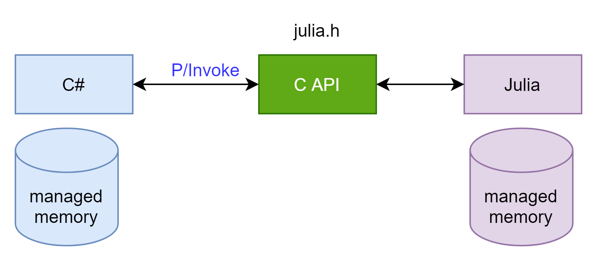

# Julia & C# interoperation via embedding

## Principle
As documented in [Embedding Julia](https://docs.julialang.org/en/v1/manual/embedding/#Embedding-Julia), Julia has exposed a set of [C API](https://github1s.com/JuliaLang/julia/blob/HEAD/src/julia.h) to allow other languages to integrate Julia code.  

In C# (or VB.net), we can resort to the [P/Invoke](https://docs.microsoft.com/en-us/dotnet/standard/native-interop/pinvoke) technique to call a C/C++ API. The overall work flow is thus:

As emphasized above, C# and Julia have two separate worlds of managed memory. Proper memory management is critical.

## Tutorials with raw C API
The following tutorials all work with the raw form of C API present in [julia.h](https://github1s.com/JuliaLang/julia/blob/HEAD/src/julia.h) to facilitate understanding. No sophisticated wrapper is used.
1. [Introduction](./EJStarter/): basic concepts and operations
2. [Working with arrays](./EJArrays): how to pass around arrays between Julia and C#
3. [Memory management](./EJMemory): how to keep the two worlds of managed memory safe
4. [A toy example: solve linear equations](./EJToyApp): use the techniques we have learned and cooperate with [Math.NET](https://www.mathdotnet.com/)